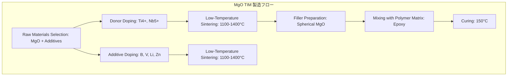

---
<div align="center">

</div>
---

### 1．１回目のトライアル：AIを信じて「自由」を与えた結果の20点

私はGemini 3.1 Proの実力を確かめるため、先端パッケージングの最新論文（[MgOフィラーによる高放熱材料](#ref-MgO_filler)）からARIAへ与える因果関係を抽出する作業を依頼しました。最新の大規模言語モデルの性能を信じ、指示はシンプルに「材料、工程、特性の因果関係をMarkdown形式で抽出して」というものにしました。

出力されたMarkdownファイルの内容は、一見すると、分かりやすくまとまっています。「これ、イケてるかも。楽して次の作業に進める！」という大きな期待も虚しく、実際の採点結果は「20点の赤点！」。

#### 抽出結果に潜んでいた「致命的な欠陥」

1. **3つの製造プロセスの混濁と欠落**：
バルク用ディスク、粉末状フィラー、それらと樹脂を混ぜ合わせた熱界面材料(TIM)という目的別に３つの独立した製造プロセスが記載されていましたが、無理やり一つのプロセスにまとめてしまっていました。その結果、焼結(Sintering)の後にフィラーの準備が来るという、論理矛盾を起こしていました。これを見た当初、これほど馬鹿げた矛盾をAIが許容しているとは思っておらず、このプロセスを私はどこで読み落としたのか探しました。しばらくして、**AIによるハルシネーション**だという思いに至り、ガックリと肩を落としました。

また、ボールミリング（混合）、CIP（冷間等方圧加圧）、スプレードライ（噴霧乾燥）、高分子前駆体法といった、形状を決定づける最重要プロセスが完全に欠落していました。このような欠陥データをARIAに投入するなど、**言語道断**です。

  **第1回製造プロセス抽出結果**



2. **因果関係の「浮遊」**  ：
工程(P)、構造(S)、特性(P)が、それぞれ独立した章に箇条書きになっており、「どの条件(ドーパントや温度)での処理が、最終的な熱伝導率の向上に寄与したのか」という、因果の連鎖が完全に断ち切られていました。このようなMarkdownから、高純度な知識グラフは作成できません。AIが良しなに捏造した(結合した)知識グラフが作成されることは明らかです。

<div align="center">

</div>
  
3. **コンテキストの巧妙な捏造**：
  熱伝導率の数値は、一部シミュレーションにより得られた**理論値**が、あたかも**実測値**のように記載されていました。材料研究者にとって、**計算による理論値**と**実測値**は全く違う意味を持ちますが、AIがVibe的に処理すると、どちらも同じとして扱われます。パッと見た時に捏造だと気づきにくい巧妙な捏造です。(下記、Cooling Performanceが理論値)

  ```
  ### Property (特性・信頼性)
  - **High Thermal Conductivity (TC)**: Novel LT MgO achieves ≥80 W m⁻¹ K⁻¹, significantly higher than the conventional 40-60 W m⁻¹ K⁻¹.
  - **TIM Thermal Conductivity**: MgO-based TIMs achieve 8.0 - 10.0 W m⁻¹ K⁻¹ (compared to 3.0 W m⁻¹ K⁻¹ for commercial Al2O3 TIMs).
  - **Cooling Performance**: Cools EV batteries 3 times faster than commercial alternatives (reduces temperature from 80°C to 40°C 2.5 times faster).
  ```

---

### 2．戦略の転換：「二段構え」のAIエージェント矯正術

#### 1. メタ・プロンプティング

二段構えの矯正術である、メタ・プロンプティングとは、プロンプトを直接AIに投げ込むのではなく、AIエージェントにはプロジェクトの全体像に関する情報を与え、AI自身に「作業計画」を書かせます(1st step)。その後、私は、AIが立てた作業計画が適切かをチェックします(2nd. step)。つまり、AIを「プロジェクトの設計パートナー」として扱いつつ、二段階で私のVibeを注入する手法、それがメタ・プロンプティングです。

読者の方に「おっ」と思っていただきたいポイントは、今回のように複雑な工程や作業を必要とするタスクでは、AIにプロンプトを直接注入して強制するのではなく、私のVibeを「AI自身が立てた作業計画」の中に書き込ませることで、順守すべき「憲法」として認識させる方法だということです。

#### 2. 注入した私の「Vibe(専門知識)」

致命的欠陥を正すには「どんなVibe(専門知識)が必要か？」を知るために私が取った作戦は、**AIと「別チャット」で徹底的な原因究明を行うこと**です。そして、明らかになった致命的欠陥の根幹は、「自由過ぎる形式（Markdown）」故に、材料科学では常識的な「物理的な縛り」がほとんど抜け落ちている、ということです。

そこで私は「物理的な縛り」の設計に着手し、最終的に以下の6つにまとめました。

**私が注入した６つのVibe**

  1. State-Transition Model：一つのProcessに対して、その直後の物理状態(Structure/Property)をセットで記述せることで、「工程(P)-原因(S)-結果(P)」型を強制します
  2. Strict Missing Rule：PSPのいずれかの要素の記載が見当たらない時は`NOT_STATED`と記載することで、AIによる推測・捏造させないようにします
  3. Notation Map：略号とそれらを正式名称に展開したMapを作成させます。筆者特有の略号は後からの名寄せが難しくなるため、この段階で正式名称に展開しておきます（例：TN-MgO (Magnesium oxide co-doped with Titanium and Niobium)）
  4. 数値データの範囲記載の方法、物理定数の定義の紐づけ：例えば、「温度が1100-1400」と文字列で記載するのではなく、{"min":1100, "max":1400, "unit": "C"}のように数値型で構造化させることで再利用性を高めました
  5. Truth of Process：材料科学の定石（例：成形→焼結等）を遵守させ、かつ製造ルールが複数分岐する場合は個別の因果連鎖として分離記述させました
  6. Setting of Escape Route：ここが**最もホットなポイント**でしたが、**「不明点を懸念事項として報告」**させることで、「2.Strict Missing Rule」の順守率が向上したことです。Escape Routeがない時、AIは「正解を出さなければならない」という強迫観念から、情報を捏造(補完)する傾向が強くなります。そこに、「わからないと報告することこそが正解である」という報酬系に書き換えたことで、精度が向上したと考えられます。

---

### 3. 第2回のトライアル：90点の覚醒

新しく設計した「物理的な縛り」に基づき、再度[MgOフィラーによる高放熱材料](#ref-MgO_filler)の論文から因果関係の抽出を行った結果、「一級燃料」が抽出されました。（結果のJSONを挿入する）

#### 3-1. 「捏造」から「懸念報告」への変化

第1回のトライアルでは「計算値」を「実測値」とひとまとめに表記していたAIが、今回は正しく数値を分類しました。さらに **「フィラーの作成工程において、スプレードライの具体的に条件が論文中に欠落しており、推論に飛躍がある」**と、技術的懸念事項を自ら申告してきたのです。

#### 3-2. ３つの独立製造ルートの再現

バルク、フィラー、TIMそれぞれの依存関係と時間軸が正しく整理され、かつ、以前は抜け落ちていた「ボールミリング（混合）、CIP（冷間等方圧加圧）、スプレードライ（噴霧乾燥）、高分子前駆体法」といった重要項目も正しく抽出されました。（結果のJSONを挿入する）

これで、ARIAがそのまま対論に使えるレベルの構造化データ（JSON-LD）が完成しました。

---

### 4. 結び：AIを「プロジェクトの設計パートナー」として認めることの大切さ

Geminiのような大規模言語モデルの性能進化は著しいため、VibLogのコンセプトを初めて知った読者の中には、**「どうせAIに丸投げする検証でしょ！」**と思ったかもしれません。しかし、どんなにAIの性能が向上しようとも、私にとって**AIはパートナー**であり、「AIとの向き合い方」を間違えると、成功への道は遠のきます。今回の記事を参考に、材料研究者の一人でも多くが、AIをパートナーとして使いこなしてもらえれば、こんなにうれしいことはありません。

さて、次回はいよいよ、論文から抽出した因果情報をARIAに注入した結果をお伝えする予定です。実のところ、この原稿を執筆時点では、ARIAにデータを注入する作業は行っておらず、どこに着地するのか筆者にも全く分からずドキドキが止まりません。結果をいつお伝えできるか分かりませんが、期待して待っていてもらえると幸いです。

#### 参考文献 / References

<div id="ref-MgO_filler"></div>
- **[Advanced Thermal Interface Materials: Insights into Low-Temperature Sintering and High Thermal Conductivity of MgO](https://doi.org/10.1002/adma.202510237)** *S.-J. Ha et al. (2025)*

  従来のMgOの熱伝導率を大きく改善する製造手法に関する報告。高性能な放熱剤として知られる窒化ホウ素同等レベルの放熱性と低コストを両立できる材料として有望視されている。
