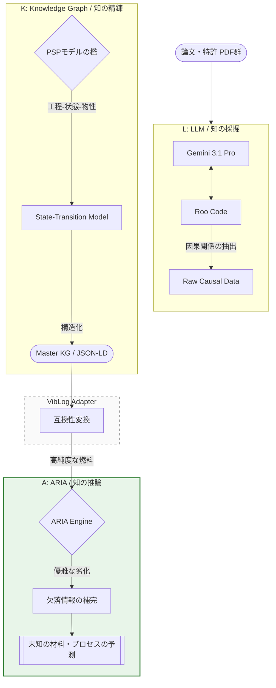

---

---

### 1．はじめに：記述の不十分な世界で、私たちは「AI」を信じられるか？

前回の記事では、先端パッケージングという技術進展が凄まじく、かつ論文の記述が不十分な分野において、データの欠落を補完する推論エンジン「[ARIA](#ref-aria)」が救世主になりえるのか、という問いを投げかけました。

長年、化学業界で飯を食ってきた私の実感としては、論文や特許は「肝心なこと」が抜け落ちています。その行間を読み解き、点と線をつなぐことを「Vibe（直感）」と呼び、また、そのようなことをできる者を「熟練者／専門家」と称してきました。

[ARIA](#ref-aria)は、その「行間」を埋めてくれる「熟練者／専門家」であるといいます。しかし、ここで、一つの根源的な疑念が浮かびます。

**「もし、エンジン（ARIA）に投入するデータそのもの（あるいはそこから作り出された知識グラフ）が、AIの吐き出した『もっともらしいウソ（ハルシネーション）』交じりの不正確なものだったら？」**

エンジンの性能を云々する前に、まず私たちはARIAに与える「因果の純度」を極限まで高めた燃料を作り出す仕組みを持たなくてはいけません。そう考え、私は独自のパイプラインを構築しました。

それが、本プロジェクトの核となる「VibLog（バイブログ）」です。

具体的には、**L（LLMによる採掘）**、**K（知識グラフによる精製）**、**A（ARIAによる推論）**の3つのステップを繋いだパイプラインであり、私はこれを親しみを込めて **「L-K-A」**と呼んでいます。

---

### 2．VibLogの心臓部：L-K-Aパイプライン

VibLogは、単なるAIによる要約ツールではありません。熟練者の「Vibe」を、材料科学の「Logic」へと変換し、最終的に「ARIA」へつなぐための3段構えの精錬所です。

<em>図1：VibLogにおけるL-K-Aパイプラインの概念図。物理の型（PSP）を経て因果を精錬する。</em>

#### 2-1. L (LLM / 採掘)：Gemini 3.1 Proによる知の採掘

まずは、Gemini 3.1 Proという強力な重機を使い、論文の海から因果関係を抽出します。しかし、ただ「因果関係を抽出して」と頼むだけでは、AIは「要約レベルの20点の回答」しか出してきません。前後関係がバラバラなプロセスフローを示すなど、多くの欠陥が存在します。

#### 2-2. K (Knowledge Graph / 精製)

掘り出した知見を、そのままARIAに渡すことはできません。そこで、私は[Tsitsvero](#ref-tsitsvero)の知見を取り入れ、PSP (Process-Structure-Property)という材料科学の「型」を用意しました。

単なるデータの羅列ではなく、「この工程（Process）を経た瞬間に、物理状態（Structure）がどう変化し、その結果その物性（Property）が生まれたのか」という**状態遷移モデル (State-Transition Model)**の型に、AIの思考を閉じ込めます。

#### 2-3. A ([ARIA](#ref-aria) / 推論)：磨き上げられた「因果の鎖」による予測

物理法則の型というフィルターを通過し、不純物 (ハルシネーション)をそぎ落とされたデータこそが、ARIAにとっての「一級品の燃料」となります。この高純度な知識グラフ（KG）を読み込ませることで、初めて「データの欠落がある条件下でも、論理的に正しい推論」が可能になります。

---

### 3. なぜ「急がば回れ」のPSP構造が必要なのか？

実は、ARIAに投入する知識グラフはPSP型ではなく、「原因－結果」というフラットなKG（JSON）です。なぜ、PSP型を経由するという回りくどいやり方が必要なのでしょうか？

#### ① AIの「嘘」を見抜く自己検閲機能

AIに「AとBの相関を抜き出して」と頼むと、文脈を無視した適当なペアを作ることがあります。しかし、「Process → Structure → Property」という多層構造を強いると、AIは「焼結処理したのなら、構造が変化し、物性も変化していなければ理屈に合わない」という論理的な自己検閲を強制されます。この「多層的な整合性」を求めること自体が、強力なバリデーション（検証）として機能します。

#### ② 「実践可能性」というラストワンマイル

私や、この記事を読んでいる皆さんが今後「自分たちで独自の知識グラフを構築したい」と考えたとき、その手法がブラックボックスであっては意味がありません。

「使えるツールか否か」は、ツール単体の性能だけではなく、前後の作業を含めたワークフロー全体が、人間の直感（Vibe）に照らして「確証」が持てるかどうかで決まります。VibLogというパイプラインを提示することは、だれでも「知の精錬所」を再現できることを証明するための、避けては通れない必然の工程なのです。

---

### 4. 結び：君に決めた！　最強のパートナー「Roo Code + Gemini 3.1 Pro (Google AI Studio)」

この複雑な因果の鎖を一人で編み上げるのは困難です。Vibeを貫くためのパートナーが必要です。世の中には様々なAIツールが存在しますが、個人的な検証を継続的に続けるためには「性能」と「コスト」のバランスが重要です。

そこで今回選んだのが、「Roo Code + Gemini 3.1 Pro (Google AI Studio)」 の組み合わせです。

まず、Gemini 3.1 Proを選んだ最大の理由は、その圧倒的なコンテキストウィンドウの広さにあります。Vibe Codingを続けていると、文脈が溜まるにつれて性能が劣化しがちですが、多量の論文を読み込ませる今回のプロジェクトでは、この広さが決定的な「武器」になります。

エージェントについては、お財布事情も含めて検討した結果、フリーで使えるオープンソースの Roo Code を選択しました。実際に使ってみると、他の商用ツールと遜色ない能力を発揮してくれています。

これで晴れて、データ変換などの泥臭い作業は彼らに任せ、私は「論理の妥当性」や「検証のワクワク感」というかじ取りに集中することができるようになりました。

それでは、次回の記事から、いよいよ具体的な格闘記に入ります。
まずは、AIが「20点」という無残なハルシネーションを吐き出したところから、いかにして「物理の型」へ追い込んでいったのか。そのプロンプトとデータの変遷を詳らかにしていきます。

#### 参考文献 / References

- **[ARIA: Autonomous Reasoning Intelligence for Atomics](https://openreview.net/pdf/18a4530187de1cf8e156b4659e29f3fa8bf39605.pdf)** *Status: Under review as a conference paper at ICLR 2026*

  LLMの推論能力と因果知識グラフを統合し、データ欠損（疎性）に対しても「優雅な劣化」を伴う推論を可能にする次世代フレームワーク。

- **[Accelerating Materials Discovery: Learning a Universal Representation of Chemical Processes for Cross-Domain Property Prediction](https://arxiv.org/abs/2512.05979)** *Mikhail Tsitsvero, et al. (2025)*

  実験プロセスを有向木（Directed-Tree）として構造化し、化学構造とプロセス論理を統一的に扱う手法の提案。

