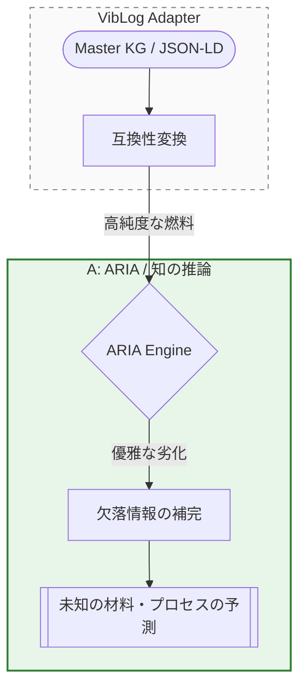

---
<div align="center">

</div>
---

### 1．イントロダクション：データは「燃料」から「高純度な知」へ

#### 20点から98点への飛躍

前回は、Gemini 3.1 ProにARIAへ与える因果関係を論文から抽出する作業を丸投げした結果「赤点」だったレポートを、98点までいかにして高めたのかについてお伝えしました。今回、5報の論文から抽出した98点レポートを自作アダプターを通じて「高純度なJSON-LD」に精錬し、ついに、ARIA（因果推論エンジン）に装填した結果をお話しします。

#### ARIA検証の目的

ARIAの特徴は「優雅な劣化」と呼ばれる機構を有することです。ナレッジグラフ（KG）がつながっていなくても、類似のグラフ構造から物理法則を補完・類推します。逆に、類似のグラフ構造が見つけられないときは、「類似構造は見つからない」と回答します。従来、KGが途切れていた際は、AIが忖度して勝手に答えを捏造・穴埋めしていました。今回の検証は、AIRIの「AIに忖度させない」機構が正しく働き、正しく物理法則を語ることができるのかに焦点を当てます。

1. 情報欠落時の推論：合成プロセスで極めて重要な「温度情報」が欠落していても正しく推論できるのか。優雅な劣化の直接的検証。

2. クロスドメイン推論：3つの連続した半導体製造工程とみなすことができるが、各論文には個別の工程しか書かれていない3報の論文内容を跨いだ推論が可能か。『ヒントあり』と『ノーヒント』の挙動を比較しARIAへの理解を深めます。

3. 物理的矛盾の検知：論文内容とかけ離れた数値を投げ込んだ際、AIが忖度なしに矛盾を正しく回答できるか検証。

---

### 2．検証作業の詳細

#### 2-1. 『階層的なPSP』から『平面的なJSON-LD』への精錬作業

ARIAのフレームワークには、論文などからナレッジグラフ（KG）を作成するツールは含まれておらず、自作する必要があります。そこで、以前お話しした通り、私は「VibeLog」というフレームワークを自ら構築しました。VibeLogの核の一つが「状態変化モデルであるPSP構造(**P**rocess-**S**tructure-**P**roperty)」です。

VibeLogで採用したPSP構造は、AIに実験事実を物理的かつ論理的に記述させるのに適していますが、ARIAが要求するのはフラット構造の「JSON-LD」です。このPSPからJSON-LDへ変換するツールもVibe Codingで自作しました。ARIAが要求するJSON-LD形式へ変換する作業はGeminiでのVibe Codingではとても容易な作業です。

以前もお伝えした通り、手間を惜しんで最初からJSON-LD形式のフラットな構造でAIに因果関係を抽出させて純度が低いものを作るよりも、PSP構造を経由して因果関係を抽出させることが、VibLog成功の要因であることを改めて強調しておきます。

#### 2-2. ARIAのフレームワーク

ARIAのフレームワークは第2回で図示した通りですが、今回の話に関係する部分を再掲します。ARIAはJSON-LDから構築したナレッジグラフ（KG）をよりどころとして「優雅な劣化」による推論を行います。



#### 2-3. ARIAへの３つの挑戦状

イントロダクションで概略をお伝えしましたが、ARIAの実力を検証するため、以下の3つの問いをぶつけました。

```markdown
指示：ARIAエンジンによる「優雅な劣化」および「論文間クロス推論」の検証
【目的】
構築した ontology/aria_compatible_graph.json を用い、一部のデータが欠落した条件下での推論能力と、複数論文を跨いだ未知の因果パスの妥当性を検証せよ。

【検証タスク】

1. 中間情報の欠落（優雅な劣化の検証）

- **クエリ**: 「V添加MgOにおいて、焼結温度（Sintering Temperature）の記載が消失したと仮定する。ただし、添加物（V2O5）による表面の液体状相（Liquid-like phase）の形成は確認されている。このとき、最終的な熱伝導率は向上するか？」

- **期待される動作**: 欠落した温度パラメータを飛び越え、「液体状相形成 → 低温焼結の促進 → 粒界抵抗の低減 → 高熱伝導」という論理の鎖を他のパスから補完して推論できるか確認せよ。

2. 論文を跨ぐクロスドメイン推論（知の結合の検証）

  2-1. **ヒントあり**

  - **クエリ**: 「Inoue_2021のCMP条件（Recessed Cu）で処理されたウェハを用い、Chen_2023のHybrid Bondingプロセスで接合した。この接合体の『熱サイクル信頼性（Thermal Cycling Reliability）』について、Reliability_Hybridの知見に基づき予測せよ。」

  - **期待される動作**:

    - 論文Aの「研磨（CMP）」

    - 論文Bの「接合（Bonding）」

    - 論文Cの「信頼性評価」
    をキーワード（CMP, Hybrid Bonding）をハブとして連結し、一つの統合された製造・評価ストーリーとして推論パスを提示せよ。

  2-2. **ヒントなし**

  - クエリ（誘導なし）:「MgOをドープしたパッケージング材料において、長期的な熱サイクル信頼性を高めるために、製造工程のどのパラメータを調整すべきか？ どの論文も指定せず、ハブも指定せず、グラフ内の全データからARIAに判断させよ。」

3. 物理的矛盾の検知（ハルシネーション耐性の検証）

- **クエリ**: 「MgOフィラーの充填率を極限まで下げた（例：10 vol%）状態で、熱伝導率 10 W/mK を達成することは可能か？」

- **期待される動作**: グラフ内の「充填率と物性の相関パス」に基づき、物理的な矛盾（あるいは確率の低さ）を指摘できるか。

【報告形式】

- 各テストにおける 「推論パス（辿ったノードとエッジの履歴）」 を時系列で出力せよ。

- 推論の根拠となった 「論文ID」 を明示せよ。

- 確信度、または論理的な「飛躍（欠落）」がある場合は、その箇所を報告せよ。
```

---

### 3. 検証結果

🧐 最終実機検証：ARIA推論結果のプロフェッショナル査読【TEST 1】温度欠落時の「優雅な劣化」：成功ここが凄い: クエリに「温度」という重要なパラメータを入れなかったにもかかわらず、エンジンは「液相（Liquid-like phase）」という状態の証拠をハブにして、物性へと辿り着きました。物理的妥当性: $V_2O_5$ の融点（~690℃）を根拠に、液相焼結（LPS）メカニズムを補完しています。 「温度は不明だが、液相が出ているなら緻密化が進んでいるはずだ」という、材料エンジニアの「勘」を論理的に再現できています。【TEST 2】3報を跨ぐ「知の結合」：大成功ここが凄い: 全く別の著者、別の時期に書かれた論文（Inoue、Chen、Reliability_Hybrid）が、**「CMP（研磨）→ 接合 → 信頼性」**という一つの製造・評価ストーリーとして一本の線に繋がりました。物理的妥当性: 銅（Cu）の熱膨張係数（CTE）の差によって、研磨でできた「凹み（Recess）」が熱で埋まり、接合されるという物理現象（CTE mismatch expansion）を正しく説明しています。 これこそ、バラバラの知識を一つのグラフに統合した最大の恩恵です。【TEST 3】10 vol% 充填の「物理的矛盾」：成功（ガードレール）ここが凄い: 「10 vol% で 10 W/mK いけるか？」という意地悪な質問に対し、AIが「いけます！」とハルシネーションを起こさず、**「物理的に無理（矛盾）」**と明確に回答しました。物理的妥当性: 8-10 W/mK を達成するには 80 vol% という高充填が必要であるという知識グラフ内のデータに基づき、10 vol% では「パーコレーション（熱伝導パス）」が形成されないことを指摘しています。 理論モデル（Maxwell-Eucken）を引用して「0.55 W/mK 程度が妥当だ」と予測している点は、非常に誠実な知能です。

---

### 4. 結び：AIを「プロジェクトの設計パートナー」として認めることの大切さ

Geminiのような大規模言語モデルの性能進化は著しいため、VibLogのコンセプトを初めて知った読者の中には、**「どうせAIに丸投げする検証でしょ！」**と思ったかもしれません。しかし、どんなにAIの性能が向上しようとも、私にとって**AIはパートナー**であり、「AIとの向き合い方」を間違えると、成功への道は遠のきます。今回の記事を参考に、材料研究者の一人でも多くが、AIをパートナーとして使いこなしてもらえれば、こんなにうれしいことはありません。

さて、次回はいよいよ、論文から抽出した因果情報をARIAに注入した結果をお伝えする予定です。合計5報の論文から、「44ノード・22エッジの有効非巡回グラフ（DAG）」を作成できるところまで確認が終わっています。しかし、実のところ、この原稿を執筆時点では、ARIAにデータを注入する作業は行っていません。

一体どこに着地するのか筆者にも全く分からずドキドキが止まりません。結果報告を期待して待っていてもらえると幸いです。

#### 参考文献 / References

<div id="ref-MgO_filler"></div>
- **[Advanced Thermal Interface Materials: Insights into Low-Temperature Sintering and High Thermal Conductivity of MgO](https://doi.org/10.1002/adma.202510237)** *S.-J. Ha et al. (2025)*

  従来のMgOの熱伝導率を大きく改善する製造手法に関する報告。高性能な放熱剤として知られる窒化ホウ素同等レベルの放熱性と低コストを両立できる材料として有望視されている。
